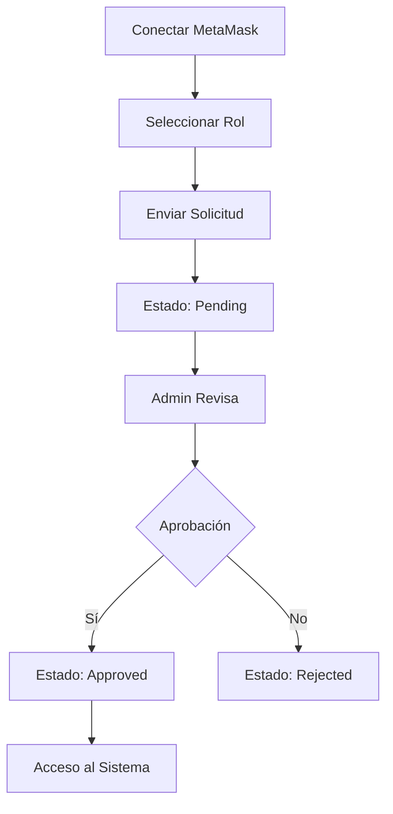
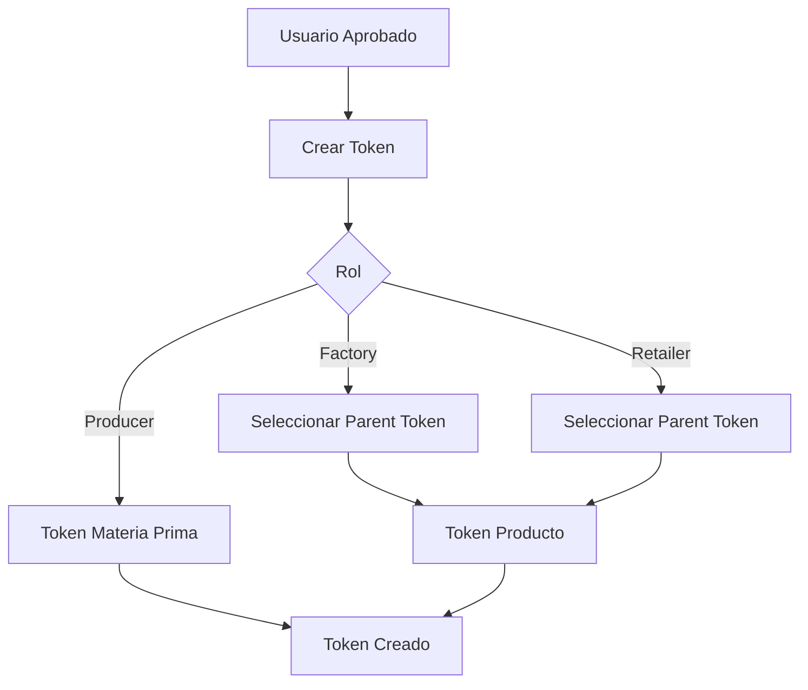
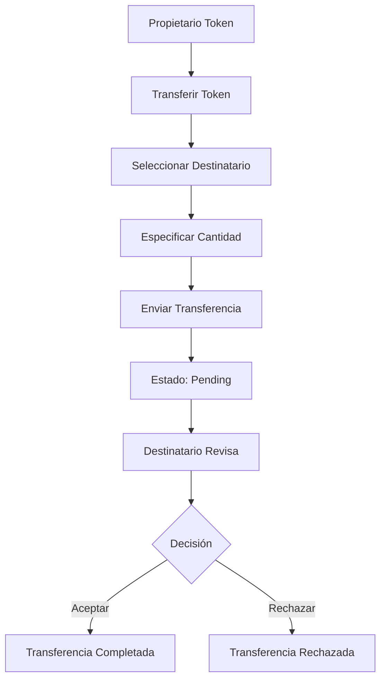

# 🔗 Supply Chain Tracker - Sistema de Trazabilidad Blockchain

## 🎬 **VIDEO DEMOSTRACIÓN**

[](https://www.loom.com/embed/3aef42be7f834a0a8485dd72778ce58e)

**👉 [VER VIDEO DEMO COMPLETO](https://www.loom.com/embed/3aef42be7f834a0a8485dd72778ce58e)** ⭐

---

## ✅ Estado: 100% COMPLETADO (28 Oct 2025)

**Supply Chain Tracker** es un sistema completo de trazabilidad basado en blockchain con una DApp moderna que permite rastrear productos desde materias primas hasta el consumidor final.

### ⛓️ **Tecnología Blockchain: ERC-1155**

Este proyecto utiliza el estándar **ERC-1155** (Multi-Token Standard) para la gestión de tokens en blockchain:

**🎯 ¿Por qué ERC-1155?**
- ✅ **Multi-Token**: Gestiona múltiples tipos de tokens en un solo contrato
- ✅ **Eficiencia de Gas**: Hasta 90% más eficiente que ERC-721 en transferencias batch
- ✅ **Flexibilidad**: Soporta tanto tokens fungibles como no fungibles
- ✅ **Trazabilidad**: Ideal para cadenas de suministro con múltiples productos
- ✅ **Estándar de OpenZeppelin**: Seguro y auditado

**📦 Implementación en el Proyecto:**
- Contrato base: `ERC1155` de OpenZeppelin
- Tokens únicos para cada lote de productos
- Balance tracking automático por usuario
- Transferencias seguras con aprobación bidireccional
- Metadatos extensibles por token

### 🎉 Implementación Completada:
- ✅ **Smart Contract ERC-1155** optimizado (27-31% ahorro de gas)
- ✅ DApp Frontend completa (Next.js 14 + TypeScript)
- ✅ Sistema de autenticación con MetaMask
- ✅ Gestión de usuarios por roles
- ✅ Creación y gestión de tokens ERC-1155
- ✅ Sistema de transferencias bidireccional
- ✅ Panel de administración con supervisión de tokens
- ✅ Vista global de tokens y trazabilidad completa
- ✅ 26/26 tests pasando
- ✅ Documentación exhaustiva (29 archivos IA)
- ✅ **[Video Demo Completo](https://www.loom.com/embed/3aef42be7f834a0a8485dd72778ce58e)** 🎬

### 📖 Documentación Clave:
- 📄 **`supply-chain-tracker/ESTADO_PROYECTO.md`** - Estado completo y detallado (lee esto primero)
- ⚡ **`supply-chain-tracker/INICIO_RAPIDO.md`** - Comandos rápidos para iniciar
- 🚀 **`supply-chain-tracker/sc/script/DeployAndSetup.s.sol`** - Script automatizado de deployment + datos de prueba
- 🔥 **`supply-chain-tracker/sc/OPTIMIZACIONES_DETALLADAS.md`** - 20 optimizaciones de gas
- 🔑 **`supply-chain-tracker/IMPORTAR_CUENTAS_METAMASK.md`** - Cuentas de desarrollo

### 🤖 **Documentación de Desarrollo con IA:**
- 🎯 **`supply-chain-tracker/IA/INFORME_DESARROLLO_IA.md`** - **INFORME PRINCIPAL** del desarrollo con IA
- 📚 **`supply-chain-tracker/IA/00_INDICE.md`** - Índice completo de 29 archivos de documentación
- ⏱️ **`supply-chain-tracker/IA/SESION_26_OCT_2025.md`** - Log detallado del proceso de desarrollo
- 📦 **`supply-chain-tracker/IA/PANEL_ADMIN_TOKENS.md`** - Panel admin con vista de tokens (NUEVO)
- 📊 **Directorio completo:** `supply-chain-tracker/IA/` **(29 archivos, ~320KB de documentación)**

## 🚀 INICIO RÁPIDO - ¡Empezar en 5 minutos!

### 📥 ¿Acabas de Descargar el Proyecto?

**⚠️ IMPORTANTE**: Este repositorio NO incluye las librerías (están en `.gitignore` para reducir tamaño). Sigue estos pasos:

#### **PASO 1: Descargar y Preparar** 📦
```bash
# Clonar el repositorio
git clone <URL_DE_TU_REPOSITORIO> 98_pfm_traza_2025
cd 98_pfm_traza_2025

# Instalar dependencias de Smart Contracts
cd supply-chain-tracker/sc
forge install

# Instalar dependencias del Frontend  
cd ../web
npm install
```

#### **PASO 2: Iniciar Blockchain Local** ⛓️
```bash
# En una terminal nueva (déjala corriendo)
cd supply-chain-tracker
anvil
```

#### **PASO 3: Desplegar Contrato + Datos** 🚀
```bash
# En otra terminal
cd supply-chain-tracker/sc
forge script script/DeployAndSetup.s.sol:DeployAndSetup --rpc-url http://127.0.0.1:8545 --broadcast

# ✅ Esto crea: contrato + 7 usuarios + 3 tokens automáticamente
```

#### **PASO 4: Iniciar la DApp** 🌐
```bash
# En otra terminal
cd supply-chain-tracker/web
npm run dev

# ✅ Abre: http://localhost:3000
```

#### **PASO 5: Configurar MetaMask** 🦊
1. **Agregar red Anvil**:
   - Network Name: `Anvil Local`
   - RPC URL: `http://localhost:8545` 
   - Chain ID: `31337`

2. **Importar cuenta Admin** (para empezar):
   - Private Key: `0xac0974bec39a17e36ba4a6b4d238ff944bacb478cbed5efcae784d7bf4f2ff80`
   - (Más cuentas en: `supply-chain-tracker/IMPORTAR_CUENTAS_METAMASK.md`)

#### **PASO 6: ¡Usar la App!** 🎉
- Ve a http://localhost:3000
- Conecta MetaMask con la cuenta Admin
- ¡Ya tienes 7 usuarios y 3 tokens listos para probar!

---

### 💡 **¿Por qué instalar dependencias manualmente?**
- ✅ Reduce el tamaño del repo (de ~500MB a ~5MB)  
- ✅ Evita conflictos de versiones entre sistemas
- ✅ Buenas prácticas de desarrollo (estándar de la industria)

**Archivos excluidos en `.gitignore`:**
- `node_modules/` → se instala con `npm install`
- `sc/lib/` → se instala con `forge install` 
- `sc/out/`, `sc/cache/` → se regeneran con `forge build`
- `.next/` → se genera con `npm run build`

---

### 🆘 **¿Problemas?** Lee la documentación completa más abajo ⬇️

---

## 🎯 Objetivos del Proyecto

**Supply Chain Tracker** es un proyecto educativo donde desarrollarás desde cero una aplicación descentralizada (DApp) completa para gestionar trazabilidad en cadenas de suministro.

### 📚 Objetivos de Aprendizaje

1. **Desarrollo de Smart Contracts**: Programar contratos inteligentes en Solidity desde cero
2. **Testing Blockchain**: Escribir y hacer pasar tests unitarios con Foundry
3. **Aplicaciones Descentralizadas (DApps)**: Construir un frontend completo que interactúe con blockchain
4. **Gestión de Roles y Permisos**: Implementar un sistema de solicitud de roles y aprobación por administrador.
5. **Integración Web3**: Conectar aplicaciones web con MetaMask y Ethereum
6. **Desarrollo Full-Stack**: Combinar tecnologías frontend modernas con blockchain

### 🤖 Objetivo relacionado con la IA

Este proyecto ha sido desarrollado **íntegramente con asistencia de Inteligencia Artificial**, documentando exhaustivamente el proceso completo.

#### ✅ **COMPLETADO - Documentación de IA Disponible:**

**📁 Ubicación:** `supply-chain-tracker/IA/` **(28 archivos de documentación)**

**🎯 Archivo Principal:** `supply-chain-tracker/IA/INFORME_DESARROLLO_IA.md`

**📊 Contiene:**
1. ✅ **IA utilizada:** Claude Sonnet 4.5 (Anthropic) vía Cursor AI
2. ✅ **Tiempo invertido por fase:**
   - Smart Contract: 6-8 horas
   - Frontend DApp: 10-12 horas  
   - Debugging: 4-6 horas
   - Documentación: 2-3 horas
   - **Total: 22-29 horas**
3. ✅ **Análisis de errores:** Documentados en archivos específicos de corrección
4. ✅ **Logs completos:** 2 sesiones principales documentadas
5. ✅ **Comparativa:** 75% más rápido que desarrollo manual (3-4x aceleración)

**📚 Otros archivos incluidos:**
- `00_INDICE.md` - Índice completo de toda la documentación
- `SESION_26_OCT_2025.md` - Log detallado del proceso
- `OPTIMIZACIONES_DETALLADAS.md` - 20 técnicas de optimización aplicadas
- `CORRECCIONES_*.md` - Solución de errores específicos
- `MEJORAS_*.md` - Iteraciones y mejoras implementadas
- **+20 archivos más** con documentación técnica completa

#### 🚧 **PENDIENTE (Opcional):**
3. Construcción de un MCP que envuelva los CLI de Foundry (anvil, cast, forge)
4. Manejo del contrato inteligente en la aplicación con IA

### 🏗️ Objetivos Técnicos

Tu aplicación final debe implementar:
- **Sistema transparente y seguro** para rastrear productos desde origen hasta consumidor final
- **Tokenización** de materias primas y productos terminados
- **Flujo controlado** entre actores: Producer → Factory → Retailer → Consumer
- **Gestión de roles** con aprobación por administrador
- **Interfaz intuitiva** para todos los roles del sistema

### 🖼️ Vista Previa de la Aplicación

Implementacion de referencia. (url )
---

## 🏭 Actores del Sistema

### 1. 👨‍🌾 **Producer (Productor)**
- **Función**: Registra materias primas en el sistema
- **Permisos**: Crear tokens de materias primas, transferir solo a Factory
- **Ejemplos**: Granjas, minas, productores agrícolas

### 2. 🏭 **Factory (Fábrica)**
- **Función**: Transforma materias primas en productos terminados
- **Permisos**: Recibir de Producer, crear productos derivados, transferir solo a Retailer
- **Ejemplos**: Plantas procesadoras, manufactureras

### 3. 🏪 **Retailer (Minorista)**
- **Función**: Distribuye productos a consumidores
- **Permisos**: Recibir de Factory, transferir solo a Consumer
- **Ejemplos**: Tiendas, supermercados, distribuidores

### 4. 🛒 **Consumer (Consumidor)**
- **Función**: Punto final de la cadena
- **Permisos**: Recibir productos, consultar trazabilidad completa
- **Ejemplos**: Usuarios finales, clientes

### 5. 👑 **Admin (Administrador)**
- **Función**: Gestiona el sistema y aprueba usuarios
- **Permisos**: Aprobar/rechazar registros, supervisar el sistema
- **Nota**: Rol único del creador del contrato

**🎯 Funcionalidades del Panel de Admin:**
- ✅ **Gestión de Usuarios** (`/admin/users`)
  - Aprobar/rechazar solicitudes de acceso
  - Cambiar estado de usuarios
  - Ver estadísticas de usuarios
- ✅ **Vista Global de Tokens** (`/admin/tokens`) ⭐ NUEVO
  - Ver todos los tokens del sistema
  - Estadísticas (total, materias primas, derivados)
  - Búsqueda por nombre o creador
  - Acceso a trazabilidad completa de cada token
- ✅ **Supervisión del Sistema**
  - Dashboard con métricas en tiempo real
  - Visualización optimizada para supervisión
  - Sin mensajes de balance personal (solo información de auditoría)

---

## 🛠️ Stack Técnico

### **⛓️ Blockchain & Smart Contracts:**
- **🔗 ERC-1155** (Multi-Token Standard) - Estándar de OpenZeppelin
- **⚡ Solidity** 0.8.20+ - Lenguaje de Smart Contracts
- **🔨 Foundry** - Framework de desarrollo y testing
- **🧪 Forge** - Testing framework con 26 tests pasando
- **⚙️ Anvil** - Blockchain local para desarrollo

### **🌐 Frontend & Web3:**
- **⚛️ Next.js 14** - Framework React con App Router
- **📘 TypeScript** - Type-safe JavaScript
- **🦊 Ethers.js** - Biblioteca Web3 para interacción blockchain
- **🎨 Tailwind CSS** - Estilos utility-first
- **🎯 Shadcn UI** - Componentes UI modernos

### **🔧 Herramientas de Desarrollo:**
- **🐙 Git & GitHub** - Control de versiones
- **📦 npm** - Gestión de paquetes
- **🔍 ESLint** - Linting de código
- **🎨 Prettier** - Formateo de código

---

## 🛠️ Prerequisitos e Instalación

### 📋 Requisitos del Sistema

Antes de comenzar, asegúrate de tener instalado:

1. **Node.js** (versión 18 o superior)
   ```bash
   # Verificar versión
   node --version
   npm --version
   ```

2. **Git**
   ```bash
   git --version
   ```

3. **Foundry** (para smart contracts)
   ```bash
   # Instalar Foundry
   curl -L https://foundry.paradigm.xyz | bash
   foundryup

   # Verificar instalación
   forge --version
   anvil --version
   ```

4. **MetaMask Browser Extension**
   - Instalar desde [metamask.io](https://metamask.io/)
   - Crear una wallet de prueba

### 🔧 Configuración del Entorno

#### 1. **Clonar el Repositorio**
```bash
git clone <URL_DEL_REPOSITORIO> 98_pfm_traza_2025

cd 98_pfm_traza_2025
```

> **📌 NOTA IMPORTANTE**: El repositorio NO incluye las librerías y dependencias (están en `.gitignore`). Debes instalarlas siguiendo los pasos siguientes.

#### 2. **Configurar Smart Contracts (`sc/`)**
```bash
cd supply-chain-tracker/sc

# Instalar dependencias de Foundry (OpenZeppelin, forge-std)
forge install

# Compilar contratos (genera carpeta out/)
forge build

# Ejecutar tests (opcional pero recomendado)
forge test

# Verificar que todo funciona
ls out/  # Debe mostrar archivos compilados
```

**¿Qué instala `forge install`?**
- `lib/openzeppelin-contracts/` - Contratos estándar de OpenZeppelin
- `lib/forge-std/` - Librería estándar de Foundry para testing
- Regenera `out/` y `cache/` (excluidos de git)

#### 3. **Configurar Frontend (`web/`)**
```bash
cd ../web

# Instalar dependencias de Node.js (genera node_modules/)
npm install

# Verificar que no hay errores de compilación
npm run build
```

**¿Qué instala `npm install`?**
Lee `package.json` e instala:
- `next`, `react`, `react-dom` - Framework Next.js
- `ethers` - Interacción con blockchain
- `tailwindcss`, `@radix-ui/*` - UI y estilos
- `typescript`, tipos y utilidades
- Todas las dependencias en `node_modules/` (excluido de git)

#### 4. **Configurar Blockchain Local**

**Terminal 1 - Ejecutar Anvil:**
```bash
# Iniciar blockchain local
anvil

# Copiar las private keys que aparecen
# Ejemplo de salida:
# Account #0: 0xf39Fd6e51aad88F6F4ce6aB8827279cffFb92266
# Private Key: 0xac0974bec39a17e36ba4a6b4d238ff944bacb478cbed5efcae784d7bf4f2ff80
```

**Terminal 2 - Desplegar Contrato:**
```bash
cd sc

# Desplegar contrato (usa una private key de Anvil)
forge script script/Deploy.s.sol \
  --rpc-url http://localhost:8545 \
  --private-key 0xac0974bec39a17e36ba4a6b4d238ff944bacb478cbed5efcae784d7bf4f2ff80 \
  --broadcast

# Copiar la dirección del contrato desplegado
```

#### 5. **Configurar MetaMask**

1. **Agregar Red Local:**
   - Network Name: `Anvil Local`
   - RPC URL: `http://localhost:8545`
   - Chain ID: `31337`
   - Currency Symbol: `ETH`

2. **Importar Cuentas de Prueba:**
   - Importar private keys de Anvil para testing
   - Recomendado: al menos 4 cuentas diferentes (
   ```
      admin (0xf39Fd6e51aad88F6F4ce6aB8827279cffFb92266), 
      producer (0x70997970C51812dc3A010C7d01b50e0d17dc79C8), 
      factory (0x3C44CdDdB6a900fa2b585dd299e03d12FA4293BC), 
      retailer (0x90F79bf6EB2c4f870365E785982E1f101E93b906), 
      consumer (0x15d34AAf54267DB7D7c367839AAf71A00a2C6A65))
   ```

#### 6. **Actualizar Configuración**

**Archivo: `web/src/contracts/config.ts`**
```typescript
export const CONTRACT_CONFIG = {
  address: "0x...", // Dirección del contrato desplegado
  abi: SupplyChainABI,
  adminAddress: "0xf39Fd6e51aad88F6F4ce6aB8827279cffFb92266" // Primera cuenta de Anvil
};
```

#### 7. **Iniciar Aplicación**
```bash
cd web

# Modo desarrollo
npm run dev

# Abrir http://localhost:3000
```

---

## 🚀 Scripts de Deployment Automático (OPCIONAL)

> **⚠️ IMPORTANTE**: Estos scripts son **completamente opcionales**. Puedes realizar todo el proceso de forma **manual**:
> - Desplegar el contrato manualmente con `forge create` o `forge script`
> - Registrar usuarios uno por uno desde la DApp
> - Aprobar usuarios desde el panel de admin
> - Crear tokens desde la interfaz web
> - Realizar transferencias paso a paso
>
> **Los scripts solo están aquí para acelerar el testing**, pero no son obligatorios.

El proyecto incluye **scripts automatizados** que despliegan el contrato y crean datos de prueba completos en un solo comando. Úsalos si quieres ahorrar tiempo en testing, o ignóralos si prefieres trabajar manualmente.

### 📁 **Scripts Disponibles (Uso Opcional)**

#### **Opción 1: Script Foundry (Solidity)** ⚡ RECOMENDADO
```bash
cd supply-chain-tracker/sc

forge script script/DeployAndSetup.s.sol:DeployAndSetup \
  --rpc-url http://127.0.0.1:8545 \
  --broadcast
```

#### **Opción 2: Script Bash (Completo)**
```bash
cd supply-chain-tracker

# Da permisos de ejecución (solo la primera vez)
chmod +x deploy_and_setup.sh

# Ejecutar
./deploy_and_setup.sh
```

> **💡 Ventaja del script bash**: Actualiza automáticamente el ABI en `web/public/contracts/`

### ✅ **¿Qué Hacen Estos Scripts?**

Los scripts automatizan todo el setup de desarrollo en **~30 segundos**:

#### **1. Desplegar Contrato SupplyChain**
- Desplegado por Admin (cuenta 0 de Anvil)
- Guarda la dirección en `sc/deployed_address.txt`

#### **2. Registrar y Aprobar 7 Usuarios Automáticamente**

| Rol | Dirección | Private Key (Anvil) |
|-----|-----------|---------------------|
| **Admin** | `0xf39Fd6e51aad88F6F4ce6aB8827279cffFb92266` | `0xac0974bec39a17e36ba4a6b4d238ff944bacb478cbed5efcae784d7bf4f2ff80` |
| **Producer1** | `0x70997970C51812dc3A010C7d01b50e0d17dc79C8` | `0x59c6995e998f97a5a0044966f0945389dc9e86dae88c7a8412f4603b6b78690d` |
| **Producer2** | `0x9965507D1a55bcC2695C58ba16FB37d819B0A4dc` | `0x8b3a350cf5c34c9194ca85829a2df0ec3153be0318b5e2d3348e872092edffba` |
| **Producer3** | `0x14dC79964da2C08b23698B3D3cc7Ca32193d9955` | `0x4bbbf85ce3377467afe5d46f804f221813b2bb87f24d81f60f1fcdbf7cbf4356` |
| **Factory1** | `0x3C44CdDdB6a900fa2b585dd299e03d12FA4293BC` | `0x5de4111afa1a4b94908f83103eb1f1706367c2e68ca870fc3fb9a804cdab365a` |
| **Factory2** | `0x976EA74026E726554dB657fA54763abd0C3a0aa9` | `0x92db14e403b83dfe3df233f83dfa3a0d7096f21ca9b0d6d6b8d88b2b4ec1564e` |
| **Retailer** | `0x90F79bf6EB2c4f870365E785982E1f101E93b906` | `0x7c852118294e51e653712a81e05800f419141751be58f605c371e15141b007a6` |
| **Consumer1** | `0x15d34AAf54267DB7D7c367839AAf71A00a2C6A65` | `0x47e179ec197488593b187f80a00eb0da91f1b9d0b13f8733639f19c30a34926a` |

> **📌 IMPORTANTE**: Importa estas cuentas en MetaMask para testing. Ver `IMPORTAR_CUENTAS_METAMASK.md`

#### **3. Crear 3 Tokens de Prueba con Metadatos Reales**

**🍅 Token 1: LOTE-TOMATES-1000KG-AAAA0001**
- **Cantidad**: 1000 kg
- **Propietario**: Producer1
- **Metadatos**: Variedad (Redondo Liso), características físicas, información nutricional, certificación Cat. I

**🥒 Token 2: LOTE-CALABACINES-1000KG-AAAA0002**
- **Cantidad**: 1000 kg
- **Propietario**: Producer1
- **Metadatos**: Variedad (Zucchini), características, usos culinarios, valores nutricionales

**🧅 Token 3: LOTE-CEBOLLAS-1000KG-AAAA0003**
- **Cantidad**: 1000 kg
- **Propietario**: Producer2
- **Metadatos**: Variedad (Amarilla), propiedades, información de almacenamiento

### 🎯 **Opción A: Testing Automático con Scripts** ⚡

Si quieres probar rápidamente sin configuración manual, usa los scripts:

```bash
# 1. Asegúrate de que Anvil esté corriendo
anvil

# En otra terminal:
# 2. Ejecuta el script de deployment
cd supply-chain-tracker/sc
forge script script/DeployAndSetup.s.sol:DeployAndSetup --rpc-url http://127.0.0.1:8545 --broadcast

# 3. Copia la dirección del contrato desplegado
# (Se muestra en la consola y se guarda en deployed_address.txt)

# 4. Actualiza web/src/contracts/config.ts con la nueva dirección

# 5. Inicia la DApp
cd ../web
npm run dev

# 6. Abre http://localhost:3000 y conecta MetaMask
# (Importa las cuentas de prueba si no lo has hecho)
```

### 🎯 **Opción B: Testing Manual (Sin Scripts)** 👨‍💻

Si prefieres hacer todo manualmente (recomendado para aprendizaje):

```bash
# 1. Asegúrate de que Anvil esté corriendo
anvil

# 2. Despliega el contrato manualmente
cd supply-chain-tracker/sc
forge create src/SupplyChain.sol:SupplyChain \
  --rpc-url http://127.0.0.1:8545 \
  --private-key 0xac0974bec39a17e36ba4a6b4d238ff944bacb478cbed5efcae784d7bf4f2ff80

# 3. Copia la dirección del contrato y actualiza web/src/contracts/config.ts

# 4. Inicia la DApp
cd ../web
npm run dev

# 5. Abre http://localhost:3000

# 6. PROCESO MANUAL:
#    a) Conecta MetaMask con cualquier cuenta de Anvil
#    b) Regístrate seleccionando un rol (Producer, Factory, etc.)
#    c) Cambia a la cuenta Admin (0xf39F...2266) en MetaMask
#    d) Ve a /admin/users y aprueba tu usuario
#    e) Vuelve a tu cuenta original
#    f) Crea tokens desde /tokens/create
#    g) Realiza transferencias a otros usuarios
#    h) Acepta/rechaza transferencias desde /transfers
```

> **💡 Ventaja del proceso manual**: Entiendes mejor cada paso del sistema y pruebas la DApp como usuario real.

### 🔄 **¿Necesitas Redesplegar?**

Si Anvil se reinicia o necesitas empezar de cero:

```bash
# Reiniciar Anvil (pierde todos los datos)
# Ctrl+C para detener Anvil actual
anvil

# En otra terminal: redesplegar todo
cd supply-chain-tracker
./deploy_and_setup.sh  # O usa el script .sol

# Limpia localStorage del navegador
# F12 → Application → Local Storage → Clear All

# Recarga la DApp
```

### 📝 **Archivos Relacionados**

- **`sc/script/DeployAndSetup.s.sol`** - (Opcional) Script Foundry completo para testing rápido
- **`deploy_and_setup.sh`** - (Opcional) Script bash automatizado
- **`sc/script/Deploy.s.sol`** - Deployment simple (solo contrato, sin datos) - Usar para manual
- **`IMPORTAR_CUENTAS_METAMASK.md`** - Guía para importar cuentas de prueba
- **`INICIO_RAPIDO.md`** - Comandos de referencia rápida

### 🤔 **¿Cuándo Usar Cada Opción?**

| Situación | Recomendación |
|-----------|---------------|
| **Estás aprendiendo el sistema** | ❌ NO uses scripts - Hazlo manual para entender cada paso |
| **Primera vez usando la DApp** | ❌ NO uses scripts - Experimenta el flujo real de usuario |
| **Desarrollo/debugging del frontend** | ✅ USA scripts - Ahorra tiempo en setup |
| **Testing de nuevas funcionalidades** | ✅ USA scripts - Setup rápido para probar cambios |
| **Demo o presentación** | ✅ USA scripts - Datos listos para mostrar |
| **Evaluación/entrega del proyecto** | ❌ NO uses scripts - Demuestra que sabes hacer todo manual |

---

## 🚀 Funcionalidades a Implementar

### 🔐 **Sistema de Autenticación Web3**
Deberás codificar:
- **Conexión con MetaMask** 
- **Persistencia en localStorage** - mantiene sesión al recargar
- **Desconexión automática** - limpia datos del localStorage
- **Detección de cambios de cuenta** - reconecta automáticamente

### 💳 **Gestión de Usuarios**
Tu implementación debe incluir:
- **Registro por roles** 
- **Aprobación por administrador** antes de usar el sistema
- **Estados**: Pending, Approved, Rejected, Canceled

### 🪙 **Sistema de Tokens**
Desarrollarás:
- **Creación de tokens** que representan productos/materias primas
- **Metadatos JSON** para características del producto
- **Sistema de parentesco** - productos derivan de materias primas
- **Balance individual** por usuario y token

### 📦 **Transferencias Controladas**
Implementarás:
- **Flujo dirigido**: Producer → Factory → Retailer → Consumer
- **Sistema de aprobación** - el receptor debe aceptar
- **Validación automática** de permisos por rol
- **Trazabilidad completa** de movimientos

### 🎨 **Interfaz Moderna**
Crearás:
- **Design responsive** con Tailwind CSS
- **Componentes reutilizables** con Shadcn UI
- **Navegación intuitiva** según rol del usuario

---

## 📱 Estructura de la Aplicación

### 🌐 **Páginas Principales**

#### **`/` - Página Principal**
- **No conectado**: Invitación a conectar MetaMask
- **Conectado pero no registrado**: Formulario de registro por rol
- **Conectado y pendiente**: Estado de espera de aprobación
- **Conectado y aprobado**: Bienvenida con acceso a dashboard

#### **`/dashboard` - Panel Principal**
- **Resumen personalizado** según rol
- **Estadísticas** de tokens y transferencias
- **Accesos rápidos** a funcionalidades principales

#### **`/tokens` - Gestión de Tokens**
- **Lista de tokens** propiedad del usuario
- **Crear token** (`/tokens/create`)
- **Detalles** (`/tokens/[id]`)
- **Transferir** (`/tokens/[id]/transfer`)

#### **`/transfers` - Transferencias**
- **Pendientes de aceptación**
- **Historial completo**
- **Acciones**: Aceptar/Rechazar

#### **`/admin` - Administración** (solo Admin)
- **Panel de administración del sistema
- **Gestión de usuarios** (`/admin/users`)

#### **`/profile` - Perfil**
- **Información del usuario**
- **Portfolio de tokens**

### 🏗️ **Estructura del Proyecto a Crear**

Tu tarea es crear toda esta estructura desde cero:

```
📁 supply-chain-tracker/
├── 📁 sc/                          # Smart Contracts
│   ├── 📁 src/
│   │   └── SupplyChain.sol         # ✅ CONTRATO PRINCIPAL
│   ├── 📁 script/
│   │   └── Deploy.s.sol            # ✅ SCRIPT DE DESPLIEGUE
│   ├── 📁 test/
│   │   └── SupplyChain.t.sol       # ✅ TESTS (26/26 PASANDO)
│   └── foundry.toml                # ✅ CONFIGURACIÓN
├── 📁 web/                         # Frontend Next.js (TU TAREA)
│   ├── 📁 src/
│   │   ├── 📁 app/                 # ⚠️ TODAS LAS PÁGINAS A IMPLEMENTAR
│   │   ├── 📁 components/          # ⚠️ COMPONENTES REACT A CREAR
│   │   ├── 📁 contexts/            # ⚠️ WEB3 PROVIDER A PROGRAMAR
│   │   ├── 📁 hooks/               # ⚠️ CUSTOM HOOKS A DESARROLLAR
│   │   ├── 📁 lib/                 # ⚠️ SERVICIOS WEB3 A IMPLEMENTAR
│   │   └── 📁 contracts/           # ⚠️ ABI Y CONFIGURACIÓN A CREAR
│   ├── package.json                # ⚠️ DEPENDENCIAS A CONFIGURAR
│   └── tailwind.config.js          # ⚠️ ESTILOS A CONFIGURAR
├── 📁 screenshots/                 # Imágenes de referencia (PROPORCIONADAS)
└── README.md                      # Esta guía (PROPORCIONADA)
```

> **⚠️ IMPORTANTE**: Solo se proporciona este README.md y las imágenes de referencia. Todo el código debe ser desarrollado por ti.

---

## 🔄 Flujos de Trabajo

### 1. **Registro de Usuario**


### 2. **Creación de Token**


### 3. **Transferencia**


---

## 📊 Estructuras de Datos a Implementar

### **🔥 PARTE 1: SMART CONTRACT (sc/src/SupplyChain.sol)**

#### **Enums a Definir**
```solidity
// ⚠️ TU TAREA: Definir estos enums
enum UserStatus { /* Estados del usuario */ Pending, Approved, Rejected, Canceled }
enum TransferStatus { /* Estados de transferencia */ Pending, Accepted, Rejected }
```

#### **Structs a Implementar**
```solidity
    enum UserStatus { Pending, Approved, Rejected, Canceled }
    enum TransferStatus { Pending, Accepted, Rejected }

    struct Token {
        uint256 id;
        address creator;
        string name;
        uint256 totalSupply;
        string features; // JSON string
        uint256 parentId;
        uint256 dateCreated;
        mapping(address => uint256) balance;
    }

    struct Transfer {
        uint256 id;
        address from;
        address to;
        uint256 tokenId;
        uint256 dateCreated;
        uint256 amount;
        TransferStatus status;
    }

    struct User {
        uint256 id;
        address userAddress;
        string role;
        UserStatus status;
    }

    address public admin;
    // contadores para los ids de los tokens, transfers y users
    uint256 public nextTokenId = 1;
    uint256 public nextTransferId = 1;
    uint256 public nextUserId = 1;
    // mapping para los tokens, transfers y users
    mapping(uint256 => Token) public tokens;
    mapping(uint256 => Transfer) public transfers;
    mapping(uint256 => User) public users;
    mapping(address => uint256) public addressToUserId;

    // eventos para los tokens, transfers y users
    event TokenCreated(uint256 indexed tokenId, address indexed creator, string name, uint256 totalSupply);
    event TransferRequested(uint256 indexed transferId, address indexed from, address indexed to, uint256 tokenId, uint256 amount);
    event TransferAccepted(uint256 indexed transferId);
    event TransferRejected(uint256 indexed transferId);
    event UserRoleRequested(address indexed user, string role);
    event UserStatusChanged(address indexed user, UserStatus status);

```

#### **Funciones del Contrato a Implementar**
```solidity
// ⚠️ TU TAREA: Programar estas funciones principales

// Gestión de Usuarios
function requestUserRole(string memory role) public { }
function changeStatusUser(address userAddress, UserStatus newStatus) public { }
function getUserInfo(address userAddress) public view returns (User memory) { }
function isAdmin(address userAddress) public view returns (bool) { }

// Gestión de Tokens
function createToken(string memory name, uint totalSupply, string memory features, uint parentId) public { }
function getToken(uint tokenId) public view returns (Token memory) { }
function getTokenBalance(uint tokenId, address userAddress) public view returns (uint) { }

// Gestión de Transferencias
function transfer(address to, uint tokenId, uint amount) public { }
function acceptTransfer(uint transferId) public { }
function rejectTransfer(uint transferId) public { }
function getTransfer(uint transferId) public view returns (Transfer memory) { }

// Funciones auxiliares
function getUserTokens(address userAddress) public view returns (uint[] memory) { }
function getUserTransfers(address userAddress) public view returns (uint[] memory) { }
```

#### **Tests a Escribir (sc/test/SupplyChain.t.sol)**
```solidity
// ⚠️ TU TAREA: Escribir y hacer pasar estos tests
contract SupplyChainTest is Test {
    // Setup y configuración inicial
    function setUp() public { }

    // Tests de gestión de usuarios
    function testUserRegistration() public { }
    function testAdminApproveUser() public { }
    function testAdminRejectUser() public { }
    function testUserStatusChanges() public { }
    function testOnlyApprovedUsersCanOperate() public { }
    function testGetUserInfo() public { }
    function testIsAdmin() public { }

    // Tests de creación de tokens
    function testCreateTokenByProducer() public { }
    function testCreateTokenByFactory() public { }
    function testCreateTokenByRetailer() public { }
    function testTokenWithParentId() public { }
    function testTokenMetadata() public { }
    function testTokenBalance() public { }
    function testGetToken() public { }
    function testGetUserTokens() public { }

    // Tests de transferencias
    function testTransferFromProducerToFactory() public { }
    function testTransferFromFactoryToRetailer() public { }
    function testTransferFromRetailerToConsumer() public { }
    function testAcceptTransfer() public { }
    function testRejectTransfer() public { }
    function testTransferInsufficientBalance() public { }
    function testGetTransfer() public { }
    function testGetUserTransfers() public { }

    // Tests de validaciones y permisos
    function testInvalidRoleTransfer() public { }
    function testUnapprovedUserCannotCreateToken() public { }
    function testUnapprovedUserCannotTransfer() public { }
    function testOnlyAdminCanChangeStatus() public { }
    function testConsumerCannotTransfer() public { }
    function testTransferToSameAddress() public { }

    // Tests de casos edge
    function testTransferZeroAmount() public { }
    function testTransferNonExistentToken() public { }
    function testAcceptNonExistentTransfer() public { }
    function testDoubleAcceptTransfer() public { }
    function testTransferAfterRejection() public { }

    // Tests de eventos
    function testUserRegisteredEvent() public { }
    function testUserStatusChangedEvent() public { }
    function testTokenCreatedEvent() public { }
    function testTransferInitiatedEvent() public { }
    function testTransferAcceptedEvent() public { }
    function testTransferRejectedEvent() public { }

    // Tests de flujo completo
    function testCompleteSupplyChainFlow() public { }
    function testMultipleTokensFlow() public { }
    function testTraceabilityFlow() public { }
}
```

### **🌐 PARTE 2: FRONTEND (web/)**

#### **Páginas a Crear (app/)**
```typescript
// ⚠️ TU TAREA: Crear todas estas páginas

app/
├── page.tsx                     // Landing/Login/Register
├── layout.tsx                   // Layout principal con Web3Provider
├── dashboard/page.tsx           // Dashboard según rol
├── tokens/
│   ├── page.tsx                // Lista de tokens del usuario
│   ├── create/page.tsx         // Crear nuevo token
│   ├── [id]/page.tsx           // Detalles del token
│   └── [id]/transfer/page.tsx  // Transferir token
├── transfers/page.tsx           // Gestión de transferencias
├── admin/
│   ├── page.tsx                // Panel de administración
│   └── users/page.tsx          // Gestión de usuarios
└── profile/page.tsx            // Perfil del usuario
```

#### **Contextos y Hooks a Programar**
```typescript
// ⚠️ TU TAREA: Implementar Web3 Provider con localStorage
// contexts/Web3Context.tsx
export function Web3Provider({ children }) {
  // Estado global de conexión
  // Persistencia en localStorage
  // Reconexión automática
  // Gestión de eventos MetaMask
}

// hooks/useWallet.ts
export function useWallet() {
  // Hook que usa Web3Context
  // Expone funciones de conexión/desconexión
  // Maneja estado de usuario y tokens
}
```

#### **Servicios Web3 a Implementar**
```typescript
// ⚠️ TU TAREA: Crear servicio de interacción con blockchain
// lib/web3.ts
class Web3Service {
  // Conexión con MetaMask
  // Interacción con smart contract
  // Manejo de transacciones
  // Conversión de datos BigInt
}
```

#### **Componentes UI a Desarrollar**
```typescript
// ⚠️ TU TAREA: Crear componentes base y específicos
components/
├── ui/                    // Componentes base (shadcn/ui)
│   ├── button.tsx
│   ├── card.tsx
│   ├── select.tsx
│   └── label.tsx
├── Header.tsx             // Navegación principal
├── TokenCard.tsx          // Tarjeta de token
├── TransferList.tsx       // Lista de transferencias
└── UserTable.tsx          // Tabla de usuarios (admin)
```

#### **Configuración a Crear**
```typescript
// ⚠️ TU TAREA: Configurar integración blockchain
// contracts/config.ts
export const CONTRACT_CONFIG = {
  address: "0x...", // Dirección de tu contrato desplegado
  abi: [], // ABI generado por Foundry
  adminAddress: "0x..." // Admin del sistema
};

// Configuración de red Anvil
export const NETWORK_CONFIG = { };
```

---

## ⚠️ Errores Comunes y Soluciones

### 🚨 **Problemas de Conexión**

**Error**: "MetaMask not detected"
```typescript
// Solución: Verificar que MetaMask esté instalado
if (typeof window.ethereum === 'undefined') {
  alert('Please install MetaMask!');
  return;
}
```

**Error**: "Wrong network"
```typescript
// Solución: Verificar chain ID
const chainId = await window.ethereum.request({ method: 'eth_chainId' });
if (parseInt(chainId, 16) !== 31337) {
  alert('Please connect to Anvil network (Chain ID: 31337)');
}
```

### 🚨 **Problemas de Smart Contract**

**Error**: "Contract not deployed"
```bash
# Solución: Verificar que Anvil esté corriendo y redesplegar
anvil & # En un terminal
forge script script/Deploy.s.sol --rpc-url http://localhost:8545 --private-key 0x... --broadcast
```

**Error**: "Transaction reverted"
```solidity
// Causa común: Usuario no aprobado
// Solución: Verificar status del usuario en /admin/users
```

### 🚨 **Problemas de Frontend**

**Error**: Next.js params Promise
```tsx
// ❌ Incorrecto en Next.js 15+
function Page({ params }: { params: { id: string } }) {
  const id = params.id; // Error
}

// ✅ Correcto
import { use } from 'react';
function Page({ params }: { params: Promise<{ id: string }> }) {
  const { id } = use(params);
}
```

**Error**: "localStorage is not defined"
```typescript
// Solución: Verificar que estamos en el cliente
if (typeof window !== 'undefined') {
  localStorage.setItem('key', 'value');
}
```

---

## 🧪 Testing y Validación

### **Tests de Smart Contract**
```bash
cd sc

# Ejecutar todos los tests
forge test

# Test específico con verbosidad
forge test --match-test testCreateToken -vvv

# Test con coverage
forge coverage
```

### **Validación de Frontend**
```bash
cd web

# Build de producción (detecta errores de tipos)
npm run build

# Linting
npm run lint

# Desarrollo con hot reload
npm run dev
```

### **Testing del Sistema Completo**

Tienes **dos opciones** para probar el sistema:

#### **Opción 1: Testing Manual** (Recomendado para aprendizaje) 👨‍💻

```bash
# 1. Despliega el contrato vacío
cd supply-chain-tracker/sc
forge create src/SupplyChain.sol:SupplyChain \
  --rpc-url http://127.0.0.1:8545 \
  --private-key 0xac0974bec39a17e36ba4a6b4d238ff944bacb478cbed5efcae784d7bf4f2ff80

# 2. Actualiza config.ts y arranca la DApp
cd ../web
npm run dev

# 3. Proceso manual completo:
#    - Conecta con diferentes cuentas de Anvil
#    - Regístralas una por una con diferentes roles
#    - Apruébalas desde el panel de admin
#    - Crea tokens manualmente
#    - Realiza transferencias paso a paso
#    - Acepta/rechaza desde la interfaz
```

#### **Opción 2: Testing Automático** (Solo para acelerar pruebas) ⚡

```bash
# Si quieres datos de prueba listos inmediatamente:
cd supply-chain-tracker/sc
forge script script/DeployAndSetup.s.sol:DeployAndSetup --rpc-url http://127.0.0.1:8545 --broadcast

# Esto crea automáticamente:
# - 7 usuarios aprobados
# - 3 tokens con metadatos completos
```

> **⚠️ NOTA**: El script automático es **OPCIONAL**. Para el proyecto educativo, se recomienda hacer todo manualmente para comprender mejor el sistema.

### **Casos de Prueba Recomendados**

#### **Si usaste testing manual:**
1. **Flujo completo de usuario**:
   - Registra un usuario como Producer
   - Admin aprueba el Producer
   - Producer crea un token de materia prima (ej: Trigo)
   - Registra y aprueba un Factory
   - Producer transfiere el token a Factory
   - Factory acepta la transferencia
   - Factory crea un producto derivado (ej: Harina usando Trigo)
   - Continuar cadena hasta Consumer

#### **Si usaste testing automático:**
1. **Flujo completo con datos pre-cargados**:
   - Conectar como Producer1 (ya tiene 2 tokens: Tomates y Calabacines)
   - Transferir tokens a Factory1
   - Conectar como Factory1 y aceptar transferencia
   - Factory1 crea producto derivado usando los tokens recibidos
   - Transferir producto a Retailer y continuar hasta Consumer

#### **Pruebas comunes (manual o automático):**
2. **Validación de permisos**:
   - Intentar transferir a rol incorrecto
   - Crear token sin estar aprobado (usa cuenta nueva)
   - Acceder a páginas de admin sin permisos

3. **Estados de transferencia**:
   - Aceptar transferencia
   - Rechazar transferencia
   - Verificar actualización de balances

---

## 🎓 Plan de Desarrollo para Estudiantes

### **🚀 FASE 1: FUNDAMENTOS (OBLIGATORIO)**
1. **Configurar entorno de desarrollo**
   - Instalar Node.js, Foundry, MetaMask
   - Crear estructura de carpetas del proyecto
   - Configurar Anvil para blockchain local

2. **Desarrollar Smart Contract**
   - Programar `SupplyChain.sol` con todas las estructuras
   - Implementar todas las funciones requeridas
   - **✅ GOAL**: Todos los tests deben pasar con `forge test`

3. **Crear Frontend Base**
   - Configurar Next.js con TypeScript y Tailwind
   - Implementar Web3Provider con localStorage
   - Crear todas las páginas básicas

### **🔥 FASE 2: FUNCIONALIDAD CORE (OBLIGATORIO)**
4. **Sistema de Autenticación**
   - Conectar con MetaMask
   - Registro de usuarios por roles
   - Panel de admin para aprobaciones

5. **Gestión de Tokens**
   - Crear tokens con metadatos
   - Sistema de parentesco (productos de materias primas)
   - Visualización de tokens por usuario

6. **Sistema de Transferencias**
   - Transferir tokens entre roles
   - Sistema de aceptación/rechazo
   - Trazabilidad completa

---

## 📚 Recursos Adicionales

### **Documentación Oficial**
- [Solidity Docs](https://docs.soliditylang.org/)
- [Foundry Book](https://book.getfoundry.sh/)
- [Next.js Docs](https://nextjs.org/docs)
- [Ethers.js Docs](https://docs.ethers.org/)

### **Tutoriales Recomendados**
- [CryptoZombies](https://cryptozombies.io/) - Aprender Solidity
- [Buildspace](https://buildspace.so/) - Proyectos Web3
- [Next.js Tutorial](https://nextjs.org/learn) - React y Next.js

### **Herramientas de Desarrollo**
- [Remix IDE](https://remix.ethereum.org/) - Editor Solidity online
- [Hardhat](https://hardhat.org/) - Alternativa a Foundry
- [OpenZeppelin](https://openzeppelin.com/) - Contratos seguros

---

## ✅ Checklist de Desarrollo

### **🔧 CONFIGURACIÓN INICIAL**
- [ ] Node.js (18+) y npm instalados y verificados
- [ ] Foundry instalado (`curl -L https://foundry.paradigm.xyz | bash`)
- [ ] MetaMask instalado y configurado
- [ ] Estructura de carpetas creada desde cero
- [ ] `.gitignore` configurado correctamente (excluye node_modules/, lib/, out/, etc.)
- [ ] Anvil corriendo en puerto 8545
- [ ] Script de deployment simple creado (`Deploy.s.sol` para deployment manual)

### **⚡ SMART CONTRACT**
- [ ] `SupplyChain.sol` programado con todas las estructuras
- [ ] Enums `UserStatus` y `TransferStatus` definidos
- [ ] Structs `Token`, `Transfer`, `User` implementados
- [ ] Todas las funciones públicas programadas
- [ ] Modificadores de acceso implementados
- [ ] Script de deploy `Deploy.s.sol` creado
- [ ] Tests unitarios escritos y **TODOS PASANDO** ✅
- [ ] Contrato desplegado exitosamente en Anvil

### **🌐 FRONTEND**
- [ ] Proyecto Next.js inicializado con TypeScript
- [ ] Dependencias instaladas (ethers, tailwind, radix-ui)
- [ ] `Web3Context` programado con localStorage
- [ ] Hook `useWallet` implementado
- [ ] Servicio `Web3Service` creado
- [ ] Configuración del contrato actualizada
- [ ] Todas las páginas creadas y funcionando:
  - [ ] `/` - Landing con conexión MetaMask
  - [ ] `/dashboard` - Panel principal
  - [ ] `/tokens` y `/tokens/create` - Gestión tokens
  - [ ] `/tokens/[id]` y `/tokens/[id]/transfer` - Detalles y transferencias
  - [ ] `/transfers` - Transferencias pendientes
  - [ ] `/admin` y `/admin/users` - Panel administración
  - [ ] `/profile` - Perfil usuario
- [ ] Header con navegación implementado
- [ ] Componentes UI base creados

### **🔗 INTEGRACIÓN**
- [ ] Conexión MetaMask funcionando
- [ ] Registro de usuarios por rol implementado
- [ ] Aprobación por admin operativa
- [ ] Creación de tokens con metadatos
- [ ] Sistema de transferencias completo
- [ ] Aceptar/rechazar transferencias funcionando
- [ ] Trazabilidad de productos visible
- [ ] Persistencia en localStorage implementada

### **📱 FUNCIONALIDAD COMPLETA**
- [ ] Flujo completo Producer→Factory→Retailer→Consumer
- [ ] Validaciones de permisos por rol
- [ ] Estados visuales correctos (pending, approved, etc.)
- [ ] Manejo de errores implementado
- [ ] Design responsive funcionando
- [ ] Build de producción sin errores


### **🎯 ENTREGA FINAL**
- [x] **Demo funcionando completamente** 🎉
- [x] Repositorio publico: https://github.com/Morenofar/supply-chain-tracker
- [x] `.gitignore` correctamente configurado (NO subir node_modules/, lib/, out/)
- [x] README con instrucciones de instalación de dependencias
- [x] **📋 Documentación de IA incluida:**
  - [x] Directorio `supply-chain-tracker/IA/` con 28 archivos
  - [x] Informe principal: `IA/INFORME_DESARROLLO_IA.md`
  - [x] Índice: `IA/00_INDICE.md`
  - [x] Logs de sesiones y proceso completo
- [x] **Video demo de maximo 5 minutos:** [VER AQUÍ](https://www.loom.com/embed/3aef42be7f834a0a8485dd72778ce58e) 🎬
- [ ] Verificar que tras clonar, `forge install` y `npm install` funcionan correctamente


---

## 🤝 Soporte y Comunidad

### **💡 Tips para el Desarrollo**
- **Commits frecuentes** con mensajes descriptivos
- **Testing exhaustivo** - los tests son tu red de seguridad
- **Debugging metódico** - usa console.log y Foundry traces
- **Documentar decisiones** en comentarios del código
- **Backup de private keys** de prueba (nunca usar en mainnet)

### **🆘 Cuando Necesites Ayuda**
1. **Revisa este README** - contiene toda la información necesaria
2. **Consulta la documentación oficial** de las tecnologías
3. **Utiliza los debugging tools** de Foundry y Chrome DevTools
4. **Verifica configuraciones** - 90% de los errores son de setup
5. **Tests primero** - si el test pasa, el problema está en frontend

### **🎯 Criterios de Evaluación (Total: 10 puntos)**

#### **📊 DISTRIBUCIÓN DE PUNTOS**

**🔥 SMART CONTRACT (4.0 puntos)**
- **Estructuras y Funciones** 
- **Tests Unitarios** 
- **Deploy y Configuración** 

**🌐 FRONTEND (3.0 puntos)**
- **Páginas y Navegación** 
- **Integración Web3** 
- **UI/UX y Componentes** 
- **Flujo Completo de Usuario** 
- **Trazabilidad y Permisos**

**📝 CALIDAD DEL CÓDIGO (0.5 puntos)**
- **Organización y Limpieza** 
- **Documentación**

#### **⭐ EXTRAS 1 puntos**
- **Calidad Excepcional** 
  - Tests de frontend implementados
  - Manejo de errores robusto
  - Performance optimizada
- **Deploy en testnet**
  - Deploy en testnet real

#### **⭐ PRESENTACION VIDEO DE MAXIMO 5 MINUTOS (1.5 punto) **
- **Presentación video**
- **Demo funcionando completamente**


#### **❌ PENALIZACIONES**
- **Tests fallando**: -1.0 pt por cada test crítico que falle
- **Aplicación no funcional**: -2.0 pts si no se puede ejecutar
- **Smart contract sin deploy**: -1.5 pts
- **Sin conexión MetaMask**: -1.0 pt
- **Código sin comentarios**: -0.5 pts

#### **📋 MÍNIMO PARA APROBAR: 6.0/10**
Para obtener la nota mínima de aprobación debes cumplir:
- ✅ Smart contract deployado y con tests básicos pasando
- ✅ Frontend conectando con MetaMask
- ✅ Al menos 3 páginas principales funcionando
- ✅ Flujo básico de registro y tokens operativo

### **🏆 Objetivos de Aprendizaje Alcanzados**
Al completar este proyecto habrás aprendido:
- ✅ **Solidity** - Programación de smart contracts
- ✅ **Foundry** - Testing y deployment de contratos
- ✅ **Next.js/React** - Desarrollo frontend moderno
- ✅ **Web3 Integration** - Conexión blockchain con frontend
- ✅ **DApp Architecture** - Diseño de aplicaciones descentralizadas
- ✅ **Testing** - Estrategias de testing en blockchain
- ✅ **UX/UI** - Diseño de interfaces crypto-friendly

---

## 🎉 ¡Comienza tu Desarrollo!

**Recuerda**: Este es un proyecto desafiante pero muy recompensante. Solo tienes este README y las imágenes de referencia - ¡todo el código debe ser creado por ti!

**Próximos pasos**:
1. 📋 Estudia bien este README y las imágenes de referencia
2. 🛠️ Configura tu entorno de desarrollo
3. ⚡ Empieza por el smart contract y haz que los tests pasen
4. 🌐 Construye el frontend paso a paso
5. 🔗 Integra todo y prueba el flujo completo

¡Feliz programación! 🚀💻🔗